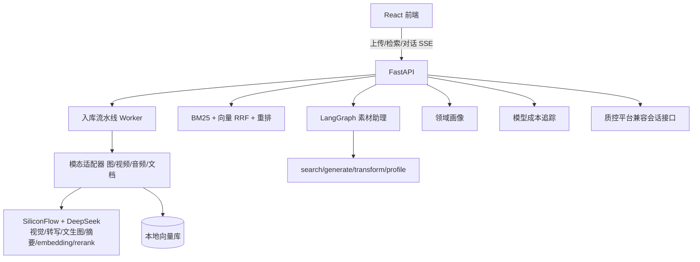

# Multimodal Asset Agent（多模态素材 Agent）


> 不预设领域的多模态素材管理 Agent——上传什么素材，它就自动"长成"什么方向的素材中心。

图片 / 视频 / 音频 / 文档统一入库，自动理解、打标、索引；自然语言跨模态检索；
LangGraph 素材助理 Agent 帮你搜素材、生成素材、处理素材、总结素材库。

## 核心能力

- **多模态入库自动化**：四类素材一条异步流水线——SHA-256/pHash 去重、缩略图/封面、视觉理解（描述/标签/OCR）、音视频转写、文档摘要、统一向量化，失败自动重试
- **跨模态语义检索**：自实现 BM25（jieba+二元组）+ bge-m3 向量，RRF(60) 融合，bge-reranker 精排；字段权重随素材分布自适应
- **领域自适应**：分类体系不写死，标签聚合 + LLM 洞察自动生成"我的素材库是什么领域"
- **素材助理 Agent**：LangGraph 意图识别 → 工具调用 → 组织回答，SSE 逐步推送；支持检索、详情、画像、文生图入库、素材处理（压缩/缩放/转格式）
- **成本意识**：简单图片走 Qwen3-VL-8B、复杂走 32B 的模型路由；每次模型调用记入 UsageLog，前端实时显示估算成本
- **可评测**：自建 24 素材/39 查询评测集，三种检索策略量化对比（见下方）

## 检索评测（真实模型）

| 策略 | Recall@1 | Recall@3 | MRR | NDCG@3 |
|---|---|---|---|---|
| A 纯 BM25（基线） | 0.705 | 0.756 | 0.756 | 0.753 |
| B + 向量 RRF | 0.821 | 0.936 | 0.906 | 0.912 |
| C + 重排精排 | **0.833** | 0.936 | **0.923** | **0.920** |

结论：加入语义召回后，7 条"换说法"查询（如"下雨天适合听什么"→白噪音）全部救回；
重排提升首位精度但略微牺牲 Recall@5，可按场景取舍。报告见 [docs/eval-reports/检索评测报告.md](docs/eval-reports/检索评测报告.md)。

## 技术栈

| 层 | 选型 |
|---|---|
| 后端 | Python 3.14 · FastAPI · SQLAlchemy 2.x · SQLite（可换 PG） |
| Agent | LangGraph（意图→工具→回答 状态图） |
| 多模态 | SiliconFlow：Qwen3-VL（视觉/路由）/ SenseVoice（转写）/ Qwen-Image（文生图）/ bge-m3 / bge-reranker |
| 检索 | 自实现 BM25 · RRF 融合 · 重排 · Recall@k/MRR/NDCG 评测 |
| 前端 | React 18 · Vite · TypeScript · Nginx |
| 测试/CI | pytest（53 用例）· GitHub Actions |
| 部署 | Docker Compose（backend + frontend/nginx） |

## 架构



## 快速开始

### 方式一：Docker 一键部署

```powershell
# 项目根目录建 .env（docker compose 自动读取）
# SILICONFLOW_API_KEY=sk-xxx
# DEEPSEEK_API_KEY=sk-xxx
docker compose up -d --build
```

打开 <http://localhost:8080>（前端），接口文档 <http://localhost:8000/docs>。

### 方式二：本地开发

```powershell
# 后端
cd backend
python -m venv .venv
.\.venv\Scripts\Activate.ps1
pip install -r requirements.txt
Copy-Item .env.example .env   # 填入 SILICONFLOW_API_KEY / DEEPSEEK_API_KEY
.\.venv\Scripts\python -m uvicorn app.main:app --reload --port 8000

# 前端（另开终端）
cd frontend
npm install
npm run dev
```

打开 <http://localhost:5173>。不填 Key 也能跑（自动降级：不打标/仅关键词检索）。

### 一键演示与评测

```powershell
cd backend
.\.venv\Scripts\python scripts\check_llm_apis.py   # 实测四个模型接口
.\.venv\Scripts\python scripts\demo_upload.py       # 生成 4 种素材并真实处理
.\.venv\Scripts\python scripts\demo_chat.py         # 与素材助理对话
.\.venv\Scripts\python scripts\eval_retrieval.py    # 检索评测 → docs/eval-reports/
```

## API 一览

| 方法 | 路径 | 说明 |
|---|---|---|
| POST | /api/upload | 上传素材（多文件） |
| GET | /api/assets | 素材列表/筛选 |
| GET/PATCH/DELETE | /api/assets/{id} | 详情 / 改标签 / 删除 |
| GET | /api/search?q= | 跨模态语义检索 |
| GET | /api/domain/profile | 领域画像 |
| POST | /api/chat | Agent 对话（SSE 逐步推送） |
| GET | /api/usage/summary | 模型成本追踪 |
| POST | /api/auth/register / login | JWT（质控平台等接入用） |
| POST | /api/sessions... | 质控平台兼容评测接口 |

## 目录结构

```text
├── backend/
│   ├── app/
│   │   ├── api/         # 路由（upload/assets/search/chat/domain/usage/auth/qc）
│   │   ├── agent/       # LangGraph 素材助理（tools + graph）
│   │   ├── pipeline/    # 入库流水线 + 模态适配器
│   │   ├── retrieval/   # BM25 / 向量库 / 混合检索 / 指标
│   │   ├── domain/      # 领域画像
│   │   ├── llm/         # 多模态客户端（降级/重试/路由）
│   │   └── core/        # 配置 / 数据库
│   ├── scripts/         # 实测 / 演示 / 评测
│   └── tests/           # 53 个 pytest 用例（LLM 全 mock）
├── frontend/            # React + Vite + TS
├── docs/                # 设计与进度文档 + 评测报告
└── docker-compose.yml
```

## 文档导航

- [00-项目概述](docs/00-项目概述.md)
- [01-功能设计](docs/01-功能设计.md)
- [02-架构设计](docs/02-架构设计.md)
- [03-开发规范](docs/03-开发规范.md)
- [04-开发计划](docs/04-开发计划.md)
- [05-简历项目介绍](docs/05-简历项目介绍.md)
- [06-接入质控平台](docs/06-接入质控平台.md)
- [检索评测报告](docs/eval-reports/检索评测报告.md)
