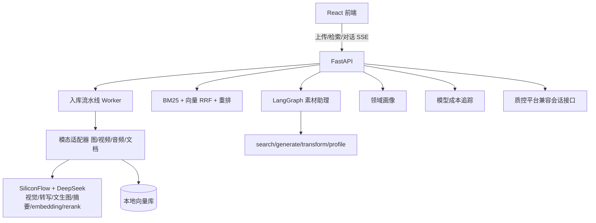

# Multimodal Asset Agent（多模态素材 Agent）


> 不预设领域的多模态素材管理 Agent——上传什么素材，它就自动"长成"什么方向的素材中心。

图片 / 视频 / 音频 / 文档统一入库，自动理解、打标、索引；自然语言跨模态检索；
LangGraph 素材助理 Agent 帮你搜素材、生成素材、处理素材、总结素材库。

## 核心能力

- **多模态入库自动化**：四类素材一条异步流水线——SHA-256/pHash 去重、缩略图/封面、视觉理解（描述/标签/OCR）、音视频转写、文档摘要、统一向量化，失败自动重试
- **跨模态语义检索**：自实现 BM25（jieba+二元组）+ bge-m3 向量，RRF(60) 融合，bge-reranker 精排；字段权重随素材分布自适应
- **领域自适应**：分类体系不写死，标签聚合 + LLM 洞察自动生成"我的素材库是什么领域"
- **素材助理 Agent**：LangGraph 任务规划（LLM 结构化参数）→ 多步工具循环 → 组织回答，SSE 逐步推送；支持检索、详情、画像、文生图入库、素材处理、会话记忆落库
- **执行轨迹可观测**：Agent 每跑一步实时推送 plan / tool 结构化事件（工具名、耗时、命中素材、片段时间戳），前端渲染成可点击的轨迹卡片；会话记忆支持列表 / 历史回看 / 多会话切换
- **多用户隔离**：JWT 登录后素材 / 检索 / 领域画像 / Agent 会话全部按 owner 隔离（未登录自动降级为 local 访客，方便本地体验）；媒体文件经 /media 直接可播放
- **评测仪表盘**：/eval 页把 45×5 检索评测量化对比与结论可视化，数据与 docs/eval-reports 同源
- **可靠性工程**：Agent 回答做引用校验（#id 必须来自本轮工具结果，防幻觉硬规则）；API / Agent 检索全量落日志，/api/metrics/search 输出平均与 P95 延迟、高频查询
- **进阶检索**：以图搜图（VL 图片向量）、音视频转写片段时间戳检索（"找我说过 XX 的那一段"）
- **成本意识**：简单图片走 Qwen3-VL-8B、复杂走 32B 的模型路由；每次模型调用记入 UsageLog，前端实时显示估算成本
- **可评测**：自建 24 素材/39 查询评测集，三种检索策略量化对比（见下方）

## 检索评测（真实模型）

| 策略 | Recall@1 | Recall@3 | Recall@5 | MRR | NDCG@3 |
|---|---|---|---|---|---|
| A 纯 BM25（基线） | 0.611 | 0.678 | 0.678 | 0.667 | 0.667 |
| B + 文本向量 RRF | 0.733 | 0.833 | 0.911 | 0.828 | 0.813 |
| D + 朴素三路融合(VL) | 0.567 | 0.733 | 0.778 | 0.697 | 0.684 |
| E + 门控三路融合 | 0.733 | 0.900 | **0.956** | 0.851 | 0.855 |
| C + 重排精排 | **0.789** | **0.944** | 0.944 | **0.893** | **0.900** |

结论（45 查询，含语义改写 + 纯视觉查询）：
1. 文本向量解决"换说法"查询（BM25 覆盖不了）；
2. **朴素多模态融合是负结果**：VL 图片向量对纯视觉查询有用，但会把语义查询前几名灌满图片（Recall@1 -0.167）；
3. **门控启用**（仅视觉查询走 VL）恢复并超越：Recall@5 0.956 全场最高，验证"多模态信号按查询类型启用"；
4. 重排精排做最终兜底：Recall@1 0.789 / MRR 0.893 / 零 Recall@5 失败。

报告见 [docs/eval-reports/检索评测报告.md](docs/eval-reports/检索评测报告.md)。

> **向量后端验证（实测）**：同一 45×5 评测集上，Milvus 后端与本地向量库结果完全一致
> （Recall@1 0.789 / Recall@5 0.956 / MRR 0.893），证明向量层可平滑切换
> （`VECTOR_BACKEND=milvus`，需先 `docker compose --profile milvus up -d`；连接失败自动降级本地）。

## 技术栈

| 层 | 选型 |
|---|---|
| 后端 | Python 3.14 · FastAPI · SQLAlchemy 2.x · SQLite（可换 PG） |
| Agent | LangGraph（意图→工具→回答 状态图） |
| 多模态 | SiliconFlow：Qwen3-VL（视觉/路由）/ SenseVoice（转写）/ Qwen-Image（文生图）/ bge-m3 / bge-reranker |
| 检索 | 自实现 BM25 · RRF 融合 · 重排 · Recall@k/MRR/NDCG 评测 |
| 前端 | React 18 · Vite · TypeScript · Nginx |
| 测试/CI | pytest（74 用例）· GitHub Actions |
| 部署 | Docker Compose（backend + frontend/nginx） |

## 架构



## 快速开始

### 方式一：Docker 一键部署

```powershell
# 注意：Docker 读根目录 .env；本地开发（方式二）读 backend/.env
Copy-Item .env.example .env     # 然后编辑 .env 填入 Key 与 JWT_SECRET
docker compose up -d --build
```

打开 <http://localhost:8080>（前端），接口文档 <http://localhost:8000/docs>。
不填 Key 也能起（自动降级：不打标、仅关键词检索）；填入
SILICONFLOW_API_KEY / DEEPSEEK_API_KEY 后获得完整多模态理解与语义检索。

### 方式二：本地开发

```powershell
# 后端
cd backend
python -m venv .venv
.\.venv\Scripts\Activate.ps1
pip install -r requirements.txt
Copy-Item .env.example .env   # 填入 SILICONFLOW_API_KEY / DEEPSEEK_API_KEY
.\.venv\Scripts\python -m uvicorn app.main:app --reload --port 8000

# 前端（另开终端）
cd frontend
npm install
npm run dev
```

打开 <http://localhost:5173>。不填 Key 也能跑（自动降级：不打标/仅关键词检索）。

### 一键演示与评测

```powershell
cd backend
.\.venv\Scripts\python scripts\check_llm_apis.py   # 实测四个模型接口
.\.venv\Scripts\python scripts\demo_upload.py       # 生成 4 种素材并真实处理
.\.venv\Scripts\python scripts\demo_chat.py         # 与素材助理对话
.\.venv\Scripts\python scripts\eval_retrieval.py    # 检索评测 → docs/eval-reports/
```

## API 一览

| 方法 | 路径 | 说明 |
|---|---|---|
| POST | /api/upload | 上传素材（多文件） |
| GET | /api/assets | 素材列表/筛选 |
| GET/PATCH/DELETE | /api/assets/{id} | 详情 / 改标签 / 删除 |
| GET | /api/search?q= | 跨模态语义检索 |
| POST | /api/search/image | 以图搜图（上传参考图） |
| GET | /api/search/transcript | 音视频转写片段时间戳检索 |
| GET | /api/domain/profile | 领域画像 |
| POST | /api/chat | Agent 对话（SSE 逐步推送） |
| GET | /api/usage/summary | 模型成本追踪 |
| GET | /api/chat/sessions | 会话列表（消息数 / 最后消息 / 最近活跃） |
| GET | /api/chat/sessions/{id}/messages | 单个会话历史消息 |
| GET | /api/metrics/search | 检索日志指标（总量 / 平均与 P95 延迟 / 高频查询） |
| POST | /api/auth/register / login | JWT（质控平台等接入用） |
| POST | /api/sessions... | 质控平台兼容评测接口 |

## 目录结构

```text
├── backend/
│   ├── app/
│   │   ├── api/         # 路由（upload/assets/search/chat/domain/usage/auth/qc）
│   │   ├── agent/       # LangGraph 素材助理（tools + graph）
│   │   ├── pipeline/    # 入库流水线 + 模态适配器
│   │   ├── retrieval/   # BM25 / 向量库 / 混合检索 / 指标
│   │   ├── domain/      # 领域画像
│   │   ├── llm/         # 多模态客户端（降级/重试/路由）
│   │   └── core/        # 配置 / 数据库
│   ├── scripts/         # 实测 / 演示 / 评测
│   └── tests/           # 74 个 pytest 用例（LLM 全 mock）
├── frontend/            # React + Vite + TS
├── docs/eval-reports/   # 检索评测报告
└── docker-compose.yml
```

## 文档导航

- [简历项目描述](docs/resume-summary.md)
- [检索评测报告](docs/eval-reports/检索评测报告.md)
