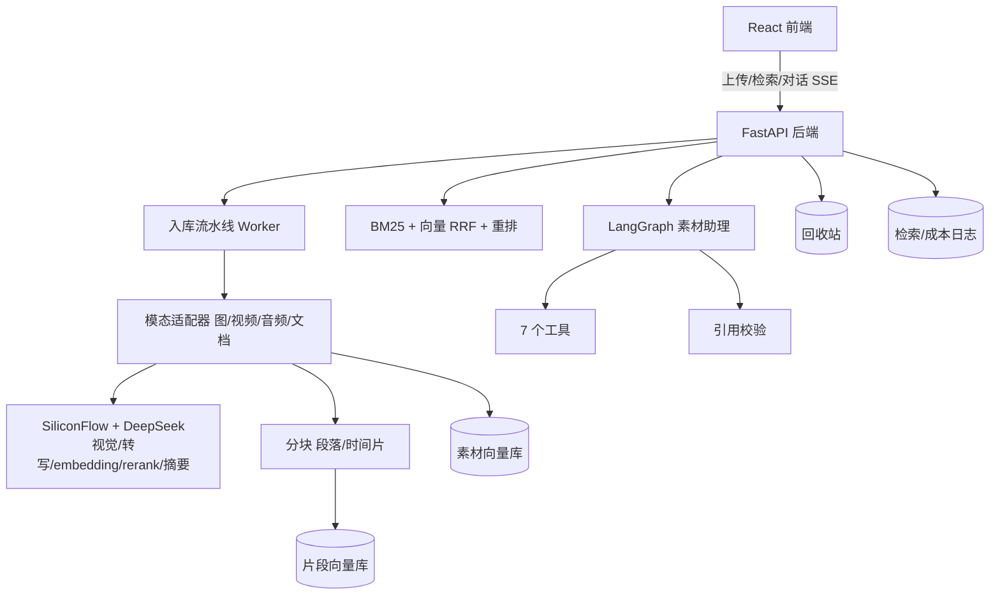

# Multimodal Asset Agent（多模态素材 Agent）

[](https://github.com/yerouguozi/multimodal-asset-agent/actions/workflows/ci.yml)

> 不预设领域的多模态素材管理系统：图片 / 视频 / 音频 / 文档统一入库，自动理解、分块、向量化；支持素材级与片段级检索，并由 LangGraph Agent 完成“检索 → 引用 → 回答”的闭环。

## ✨ 功能特性

- **统一入库流水线**：SHA-256/pHash 去重、缩略图/封面、OCR、语音转写（含时间片）、文档摘要、自动打标、统一向量化；异步任务队列 + 自动重试 + 重启自动恢复中断任务；上传流式落盘，单文件大小上限可配（默认 100MB）；
- **素材级混合检索**：自实现 BM25 + bge-m3 文本向量 + 图片 VL 向量（按查询类型门控），RRF 融合 + bge-reranker 精排；支持以图搜图与音视频转写片段时间戳检索；
- **片段级 RAG**：文档按段落、音视频按转写时间片统一分块并逐段向量化；片段级 BM25 + 向量 RRF + 重排，命中返回原文出处（第几段 / 时间戳）；旧数据首次查询自动懒补分块与向量；
- **素材助理 Agent**：LangGraph 任务规划 → 多步工具循环（检索/详情/画像/文生图/处理/片段定位/片段检索共 7 个工具）→ 组织回答；SSE 逐步推送执行轨迹；
- **防幻觉引用校验**：回答中的素材编号必须来自本轮工具结果，非法引用自动标注；对话记忆落库，支持多会话切换与历史回看；
- **素材管理**：单文件下载、多选 ZIP 打包、编辑名称/描述、按名增删标签、软删除回收站（可恢复/彻底删除）、失败素材一键重试、详情内嵌音视频播放器并可跳转转写时间片；
- **多用户与安全**：JWT 注册/登录，素材/画像/会话/成本日志全部按 owner 隔离；媒体文件受控访问（Header 或 query token + owner 校验）；
- **可观测与治理**：检索全链路日志（API / Agent 工具），平均与 P95 延迟、来源与策略分布、高频查询；每用户模型调用按日/月/小时配额限流，成本按真实模型调用记录（降级模式零记账）；
- **向量后端可切换**：本地 npz / Milvus（素材与片段各自独立命名空间，连接失败自动降级）。

## 🧪 评测体系

- **检索评测**：45 组真实查询 × 5 策略（含语义改写与纯视觉查询），指标含 Recall@k / MRR / NDCG；

| 策略 | Recall@1 | Recall@3 | Recall@5 | MRR | NDCG@3 |
|---|---|---|---|---|---|
| A 纯 BM25（基线） | 0.611 | 0.678 | 0.678 | 0.667 | 0.667 |
| B +文本向量 RRF | 0.733 | 0.833 | 0.911 | 0.828 | 0.813 |
| D +朴素三路融合(VL) | 0.567 | 0.733 | 0.778 | 0.697 | 0.684 |
| E +门控三路融合 | 0.733 | 0.900 | **0.956** | 0.851 | 0.855 |
| C +重排精排 | **0.789** | **0.944** | 0.944 | **0.893** | **0.900** |

- **片段级对比**：`backend/scripts/eval_passage_vs_asset.py` 离线样例对比整篇 Top-5 与片段 Top-1（原文含答案短语判定），报告输出至 `docs/eval-reports/`；
- **工程测试**：108 个 pytest 用例（LLM/Embedding 全部 mock，离线可跑），GitHub Actions 自动运行。

## 🏗️ 架构



设计原则：工具结果是事实来源，LLM 只负责规划与组织语言；检索按查询类型门控启用多模态信号，避免“信号越多越好”的直觉误区。

## 🛠️ 技术栈

| 层 | 技术 |
| --- | --- |
| 后端 | Python · FastAPI · SQLAlchemy · SQLite |
| Agent | LangGraph |
| LLM | SiliconFlow：Qwen3-VL / SenseVoice / Qwen-Image / bge-m3 / bge-reranker；DeepSeek |
| 检索 | 自实现 BM25 · RRF 融合 · 重排 · 门控 |
| 向量 | 本地 npz（默认）/ Milvus（可选，`docker compose --profile milvus`） |
| 前端 | React 18 · TypeScript · Vite · Nginx |
| 测试/CI | pytest · GitHub Actions |

## 📁 目录结构

```text
.
├── backend/
│   ├── app/
│   │   ├── api/          # 路由（upload/assets/search/passages/chat/usage/metrics/trash/auth）
│   │   ├── agent/        # LangGraph 素材助理（tools + graph）
│   │   ├── pipeline/     # 入库流水线、模态处理器、分块
│   │   ├── retrieval/    # BM25 / 向量库 / 片段检索 / 检索日志
│   │   ├── domain/       # 领域画像
│   │   ├── llm/          # 多模态客户端（降级/重试/路由）
│   │   └── core/         # 配置 / 数据库 / 迁移
│   ├── scripts/          # 实测 / 演示 / 评测
│   └── tests/            # 108 个 pytest
├── frontend/             # React + Vite + TS（介绍/登录/工作台/评测/指标）
├── docs/eval-reports/    # 检索评测报告
└── docker-compose.yml    # 一键部署（含可选 milvus profile）
```

## 🚀 快速开始

### 方式一：Docker 一键部署

```powershell
Copy-Item .env.example .env   # 填入 SILICONFLOW_API_KEY / DEEPSEEK_API_KEY / JWT_SECRET
docker compose up -d --build
```

前端 `http://localhost:8080`，接口文档 `http://localhost:8000/docs`。不填 Key 也能启动（自动降级为不打标、仅关键词检索）。

### 方式二：本地开发

```powershell
# 后端（密钥放 backend/.env，参考 backend/.env.example）
cd backend
python -m venv .venv
.\.venv\Scripts\Activate.ps1
pip install -r requirements.txt
python -m uvicorn app.main:app --reload --port 8000

# 前端（另开终端）
cd frontend
npm install
npm run dev
```

### （可选）启用 Milvus

```powershell
docker compose --profile milvus up -d
```

根目录 `.env` 中设置 `VECTOR_BACKEND=milvus` 后重启后端；默认 `local` 不依赖 Docker。

## ⚙️ 环境变量

| 变量 | 必填 | 说明 |
| --- | --- | --- |
| `SILICONFLOW_API_KEY` | 否* | 视觉理解 / Embedding / 转写 / 重排 / 文生图 |
| `DEEPSEEK_API_KEY` | 否* | Agent 规划、摘要与标签 |
| `JWT_SECRET` | 否 | JWT 签名密钥，生产建议修改 |
| `INGESTION_MODE` | 否 | `async`（默认）/ `sync` |
| `MAX_UPLOAD_MB` | 否 | 单文件上传大小上限（MB），默认 100，超限返回 413 |
| `VECTOR_BACKEND` | 否 | `local`（默认）/ `milvus` |
| `USAGE_DAILY_LIMIT` | 否 | 每用户今日模型调用配额，默认 200 |
| `USAGE_MONTHLY_LIMIT` | 否 | 每用户本月配额，默认 2000 |
| `USAGE_HOURLY_LIMIT` | 否 | 每用户近 1 小时配额，默认 100 |

\* 未配置时自动降级：不上模型 Key 则跳过理解/向量，仅保留关键词检索与上传入库。

## 🧪 测试

```powershell
cd backend
python -m pytest
```

预期：**108 passed**。

## 🧠 设计要点

- **门控多模态融合**：朴素三路融合在评测中拉低 Recall@1（-0.167），据此改为仅视觉查询启用 VL 向量，Recall@5 升至 0.956；
- **检索性能**：BM25 分字段 token 按素材缓存（updated_at + 标签指纹自动失效，查询零分词），过滤下推 SQL，融合后只为 top-N 候选加载完整素材行；chunk 嵌入分批请求，单批超限不拖垮整批；
- **可靠性细节**：LLM 仅对限流（429）/服务端错误/网络错误指数退避重试，鉴权与参数错误立即透传真实响应；服务重启自动续跑中断素材；彻底删除全链路清理（文件、素材与片段向量、分块与任务记录）；
- **两级检索配合**：素材级召回收敛候选，片段级精排取原文出处，二者共用日志与策略参数；
- **防幻觉两道防线**：Prompt 约束 + 代码级引用校验；工具对空结果返回明确提示；
- **懒回填**：新增分块/向量能力后，旧数据首次查询自动补齐，无需重跑入库；
- **优雅降级**：LLM Key 缺失、Milvus 不可用、重排失败、向量缺失均降级为可用状态；
- **UTC 存储 / 本地展示**：后端统一存 UTC，前端按本地时区渲染；
- **多用户闭环**：素材/画像/会话/成本/媒体访问全部按 owner 隔离，删除有回收站兜底。

## 🗺️ 后续规划

- Alembic 正式接管数据库迁移（当前为启动时最小迁移）；
- Milvus 规模化验证（千级素材基准）；
- 前端 E2E 测试；
- 超过 600 秒的长音频分片转录与合并。
