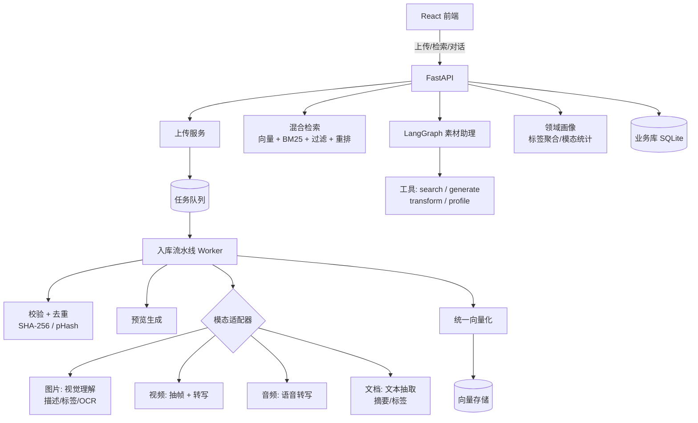
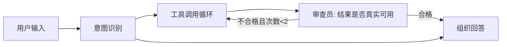

# 架构设计

## 1. 总体架构



## 2. 核心设计原则

1. **工具/检索是事实来源，LLM 是发言人**：所有搜索结果、统计数字必须来自工具真实计算，LLM 只负责组织语言；
2. **状态机不交给 LLM**：素材入库状态、任务状态、重试逻辑全部由确定性代码控制；
3. **一个引擎 + 可插拔适配器**：核心模型与检索统一，模态差异收敛在"适配器"一层（沿用 agent-qc-platform 的驱动适配器模式）；
4. **领域由数据决定**：不写死分类体系，标签聚合出领域画像，检索权重随数据分布自适应；
5. **优雅降级**：无 LLM Key、无向量服务、无网络时，系统照常可用（确定性兜底）；
6. **评测先确定性后主观性**：检索质量用指标说话，Agent 回答用 LLM-as-Judge 辅助。

## 3. 模块划分

| 模块 | 职责 | 关键设计 |
|---|---|---|
| `app/api` | REST 路由 | upload / assets / search / chat / stats / auth |
| `app/pipeline` | 入库流水线 | 队列抽象、重试、并发信号量、模态适配器（Processor 基类 + 四类实现） |
| `app/llm` | 多模态 API 客户端 | SiliconFlow（视觉/转写/文生图/embedding/rerank）+ DeepSeek（文本）；统一超时/退避/降级 |
| `app/retrieval` | 检索 | 向量存储抽象（本地实现可换 Milvus）、BM25 关键词、RRF 融合、重排、过滤 |
| `app/agent` | LangGraph 素材助理 | 意图识别 → 工具调用 → 审查 → 回复 |
| `app/domain` | 领域画像 | 标签聚合、模态统计、一句话总结、自适应加权 |
| `app/core` | 配置 / 数据库 / 工具 | pydantic-settings、SQLAlchemy、通用工具 |
| `frontend` | React 界面 | 上传、素材网格、预览、搜索、对话、统计 |

## 4. 数据模型

### Asset（素材）
| 字段 | 说明 |
|---|---|
| id | 主键 |
| name / original_filename | 名称与原始文件名 |
| modality | image / video / audio / document |
| mime_type / size_bytes | 类型与大小 |
| storage_path / thumbnail_path | 存储与缩略图相对路径 |
| sha256 | 内容哈希（精确去重） |
| phash | 感知哈希（近似去重） |
| status | pending / processing / ready / failed |
| description | LLM 生成的内容描述 |
| ocr_text / transcript | OCR 文本 / 语音转写 |
| width / height / duration | 尺寸与时长（按模态可空） |
| error_message | 失败原因 |
| created_at / updated_at | 时间戳 |

### Tag
asset_id、name、source（llm / auto / user）

### IngestionJob（任务可见性）
asset_id、stage、status、attempts、error、时间戳——支撑"队列深度/重试/进度"这类简历可讲的工程细节。

### Embedding（本地向量存储）
asset_id、model、dim、vector（BLOB）——向量存储抽象为接口，后续可无缝换 Milvus。

## 5. 入库数据流

```
上传 → 鉴权 → 保存原始文件 → 创建 Asset(pending) → 入队
Worker:
  阶段1 校验 + SHA-256 去重（命中则复用已有理解结果）
  阶段2 预览生成（缩略图/封面）
  阶段3 模态理解（描述 / 标签 / OCR / 转录）
  阶段4 向量化（统一语义空间）
  阶段5 标记 ready
失败 → 指数退避重试 ≤3 次 → 标记 failed + 错误信息
```

## 6. 检索设计（含金量核心）

统一策略：**所有模态先归一化成"描述文本"，再统一嵌入同一向量空间**，实现跨模态搜索。

对比实验（写入 docs/eval-reports/）：

| 策略 | 说明 |
|---|---|
| A 基线 | 仅描述文本 bge-m3 向量 |
| B | A + 图片级 embedding（bge-visualized 等）双路 RRF |
| C | B + BM25 关键词 + 元数据过滤 + bge-reranker 重排 |

评测集：60~100 条跨模态查询（图片/视频/音频/文档各若干），指标 Recall@k / MRR / NDCG，最终选优策略作为默认，并在 README 报告结论。

## 7. Agent 设计

LangGraph 状态图：



- 工具：search_assets / get_asset_detail / domain_profile / generate_image / transform_asset；
- 写操作（生成、处理、删除）先确认后执行；
- 所有工具返回空/异常时给 LLM 明确错误提示，禁止编造。

## 8. API 一览

| 方法 | 路径 | 说明 |
|---|---|---|
| POST | /api/auth/register / login | 注册登录（JWT） |
| POST | /api/upload | 上传素材（多文件） |
| GET | /api/assets | 素材列表（筛选/分页） |
| GET | /api/assets/{id} | 素材详情 |
| PATCH / DELETE | /api/assets/{id} | 改标签 / 删除 |
| GET | /api/search?q= | 语义检索 |
| GET | /api/stats | 领域画像与统计 |
| POST | /api/chat | Agent 对话（SSE 流式） |
| GET | /api/jobs/{asset_id} | 处理进度 |

## 9. 技术栈

| 层 | 选型 |
|---|---|
| 后端 | Python 3.14 · FastAPI · SQLAlchemy 2.x |
| 数据库 | SQLite（SQLAlchemy 访问，可平滑换 PostgreSQL） |
| 队列 | 轻量异步队列（接口抽象，可换 RQ/Celery + Redis） |
| 多模态 LLM | SiliconFlow：Qwen2.5-VL（视觉）/ SenseVoice（转写）/ FLUX（文生图）/ bge-m3 / bge-reranker |
| 文本 LLM | DeepSeek |
| 向量存储 | 本地向量存储（抽象接口，可换 Milvus） |
| 前端 | React + Vite + TypeScript |
| 测试/CI | pytest · GitHub Actions |
| 部署 | Docker Compose |

> 注：具体模型 ID 在实现时以 SiliconFlow 实际可用模型为准，全部写入 .env 可配置。
